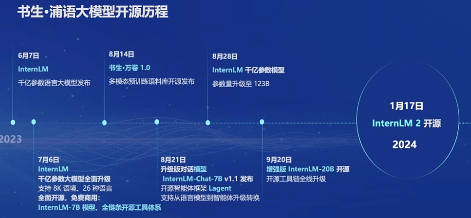
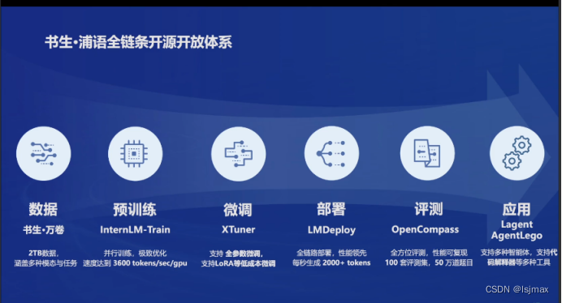
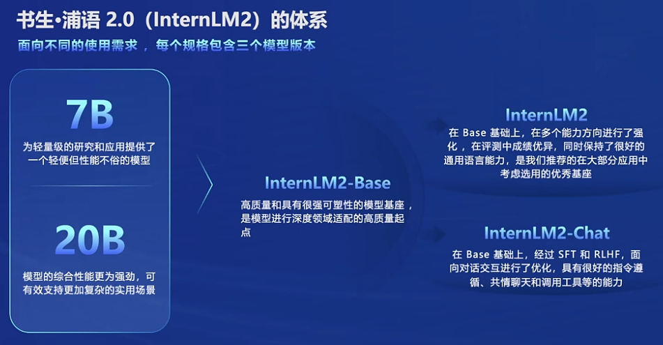
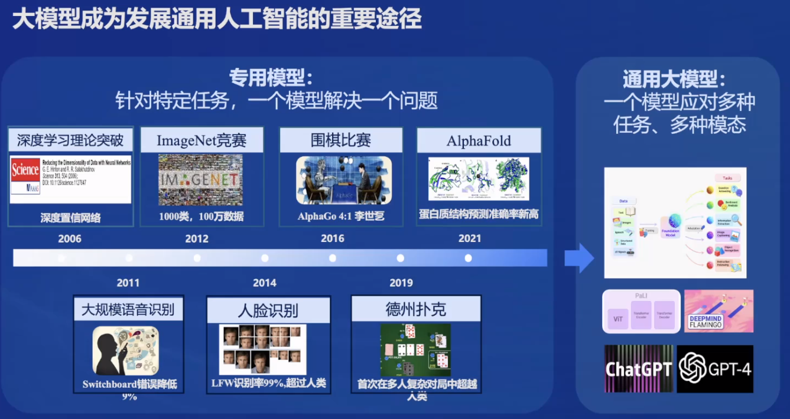
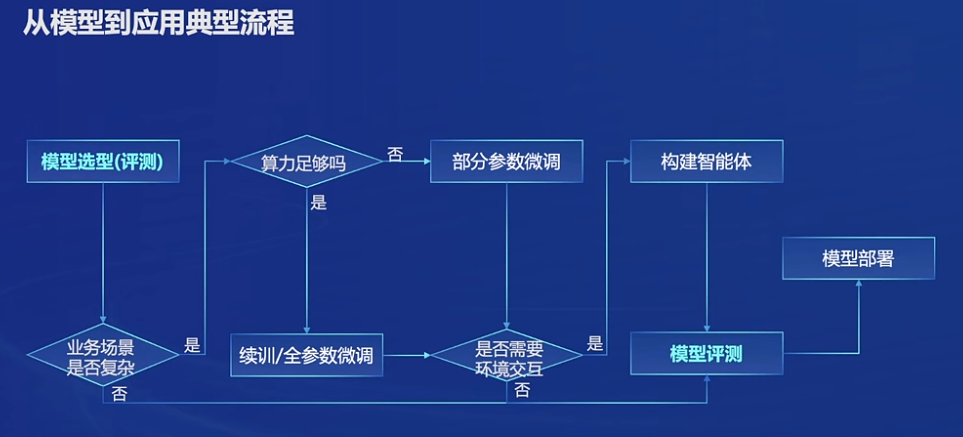
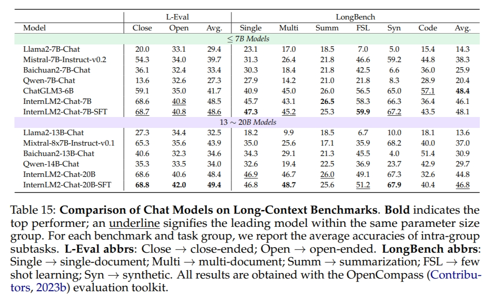

# 书生·浦语大模型实战营第二期培训总结

## 课程概览
- **讲师**: 陈恺，上海人工智能实验室青年科学家
- **课程主题**: 书生·浦语大模型全链路开源体系介绍
- **视频录屏**: [Bilibili视频链接](https://www.bilibili.com/video/BV1Vx421X72D/)

## 书生·浦语大模型发展历程

- 7月升级支持8K语境和工具体系
- 8月发布对话模型和智能体框架
- 9月发布中等尺寸模型与优化工具链

## 书生·浦语大模型全链路开源体系

- **数据准备**: 书生·万卷，包含大量多模态数据，经过价值对齐预处理
- **预训练**: InternLM-Train，采用高质量的文本数据
- **微调**: XTuner，支持多种LLM和多模态微调
- **部署**: LMDeploy，将模型部署到实际应用中
- **评测**: OpenCompass，提供全面的模型评测工具

- 
  

## 大模型的发展趋势
- **专用模型**: 针对特定任务设计。
- **通用大模型**: 一个模型应对多种任务、多种模态，如文本、语音、图像等。
  

## InternLM2的主要亮点
- **超长上下文处理**: 支持长达200k字符的上下文，有效处理复杂对话和文本。
- **综合性能卓越**: 在多个评估基准上展现出色的表现。
- **优化的对话与创作体验**: 提升用户在使用模型进行对话和创作时的体验。
- **工具调用与数据分析**: 新增功能支持上传表格进行数据分析和图形展示，增强模型的实用性。
- **数理与数据分析能力**: 支持机器学习建模，提供实用的数据功能。

## 模型到应用的典型流程
1. **模型选型**: 根据业务需求挑选合适的模型。
2. **业务场景分析**: 评估所需的算力和环境交互能力。
3. **参数微调**: 根据具体场景选择合适的微调策略。
4. **环境交互类型**: 构建适应不同需求的智能体（agent）。
5. **智能体构建**: 根据业务需求定制智能体。
6. **模型评测**: 利用OpenCompass等工具对模型进行评测。
7. **模型部署**: 将模型应用于实际业务场景中。

## InternLM2技术报告要点
- **预训练**: 包括高质量的32k文本和位置编码外推。
- **监督微调（SFT）**: 提升模型在特定任务上的表现。
- **强化学习（RLHF）**: 基于人类反馈进行优化。
- **条件在线RLHF（COOL RLHF）**: 解决偏好冲突，减少奖励作弊。
- **模型结构**: 在Transformer架构基础上进行改进，提高训练效率和性能。

## 总结
书生·浦语大模型实战营第二期培训课程为参与者提供了一个全面的视角，以理解书生·浦语大模型的全链路开源体系和InternLM2的技术亮点。通过结合CSDN博客和掘金上的信息，我们可以看到书生·浦语大模型不仅在技术上取得了显著的进步，而且在实际应用中展现出了强大的能力和潜力。这些进步不仅推动了人工智能领域的发展，也为未来的科技创新和应用提供了坚实的基础。
