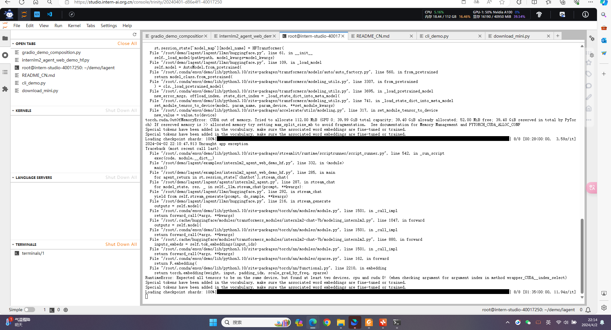

# 书生·浦语大模型实战营第二期开培训总结

# 第二课-概览

实践 4 个主要内容，分别是：

- **部署 `InternLM2-Chat-1.8B` 模型进行智能对话**
- **部署实战营优秀作品 `八戒-Chat-1.8B` 模型**
- **通过 `InternLM2-Chat-7B` 运行 `Lagent` 智能体 `Demo`**
- **实践部署 `浦语·灵笔2` 模型**

## InternLM2-1.8b实践

**进入开发机后，在 `terminal` 中输入环境配置命令 (配置环境时间较长，需耐心等待)：**

```bash
studio-conda -o internlm-base -t demo
# 与 studio-conda 等效的配置方案
# conda create -n demo python==3.10 -y
# conda activate demo
# conda install pytorch==2.0.1 torchvision==0.15.2 torchaudio==2.0.2 pytorch-cuda=11.7 -c pytorch -c nvidia
```

配置完成后，进入到新创建的 `conda` 环境之中：

```bash
conda activate demo
```

输入以下命令，完成环境包的安装：

```bash
pip install huggingface-hub==0.17.3
pip install transformers==4.34 
pip install psutil==5.9.8
pip install accelerate==0.24.1
pip install streamlit==1.32.2 
pip install matplotlib==3.8.3 
pip install modelscope==1.9.5
pip install sentencepiece==0.1.99
```

**下载 `InternLM2-Chat-1.8B` 模型**

按路径创建文件夹，并进入到对应文件目录中：

```
mkdir -p /root/demo
touch /root/demo/cli_demo.py
touch /root/demo/download_mini.py
cd /root/demo
```

双击打开 `/root/demo/download_mini.py` 文件，复制以下代码：

```
import os
from modelscope.hub.snapshot_download import snapshot_download

# 创建保存模型目录
os.system("mkdir /root/models")

# save_dir是模型保存到本地的目录
save_dir="/root/models"

snapshot_download("Shanghai_AI_Laboratory/internlm2-chat-1_8b", 
                  cache_dir=save_dir, 
                  revision='v1.1.0')
```

执行命令，下载模型参数文件：

```
python /root/demo/download_mini.py
```

**运行 cli_demo**

双击打开 `/root/demo/cli_demo.py` 文件，复制以下代码：

```
import torch
from transformers import AutoTokenizer, AutoModelForCausalLM


model_name_or_path = "/root/models/Shanghai_AI_Laboratory/internlm2-chat-1_8b"

tokenizer = AutoTokenizer.from_pretrained(model_name_or_path, trust_remote_code=True, device_map='cuda:0')
model = AutoModelForCausalLM.from_pretrained(model_name_or_path, trust_remote_code=True, torch_dtype=torch.bfloat16, device_map='cuda:0')
model = model.eval()

system_prompt = """You are an AI assistant whose name is InternLM (书生·浦语).
- InternLM (书生·浦语) is a conversational language model that is developed by Shanghai AI Laboratory (上海人工智能实验室). It is designed to be helpful, honest, and harmless.
- InternLM (书生·浦语) can understand and communicate fluently in the language chosen by the user such as English and 中文.
"""

messages = [(system_prompt, '')]

print("=============Welcome to InternLM chatbot, type 'exit' to exit.=============")

while True:
    input_text = input("\nUser  >>> ")
    input_text = input_text.replace(' ', '')
    if input_text == "exit":
        break

    length = 0
    for response, _ in model.stream_chat(tokenizer, input_text, messages):
        if response is not None:
            print(response[length:], flush=True, end="")
            length = len(response)
```

输入命令，执行 Demo 程序：

```
conda activate demo
python /root/demo/cli_demo.py
```

等待模型加载完成，键入内容示例：

```
请创作一个 300 字的小故事
```


## `InternLM2-Chat-7B`智能体

Lagent 是一个轻量级、开源的基于大语言模型的智能体（agent）框架，支持用户快速地将一个大语言模型转变为多种类型的智能体，并提供了一些典型工具为大语言模型赋能。它的整个框架图如下:


Lagent 的特性总结如下：

- 流式输出：提供 stream_chat 接口作流式输出，本地就能演示酷炫的流式 Demo。
- 接口统一，设计全面升级，提升拓展性，包括：
  - Model : 不论是 OpenAI API, Transformers 还是推理加速框架 LMDeploy 一网打尽，模型切换可以游刃有余；
  - Action: 简单的继承和装饰，即可打造自己个人的工具集，不论 InternLM 还是 GPT 均可适配；
  - Agent：与 Model 的输入接口保持一致，模型到智能体的蜕变只需一步，便捷各种 agent 的探索实现；
- 文档全面升级，API 文档全覆盖。

开启 conda 环境：

```bash
conda activate demo
```

打开文件子路径

```bash
cd /root/demo
```

使用 git 命令下载 Lagent 相关的代码库：

```bash
git clone https://gitee.com/internlm/lagent.git
# git clone https://github.com/internlm/lagent.git
cd /root/demo/lagent
git checkout 581d9fb8987a5d9b72bb9ebd37a95efd47d479ac
pip install -e . # 源码安装
```

打开 lagent 路径：

```bash
cd /root/demo/lagent
```

在 terminal 中输入指令，构造软链接快捷访问方式：

```bash
ln -s /root/share/new_models/Shanghai_AI_Laboratory/internlm2-chat-7b /root/models/internlm2-chat-7b
```

打开 `lagent` 路径下 `examples/internlm2_agent_web_demo_hf.py` 文件，并修改对应位置 (71行左右) 代码：

```python
# 其他代码...
value='/root/models/internlm2-chat-7b'
# 其他代码...
```

输入运行命令 - **点开 6006 链接后，大约需要 5 分钟完成模型加载：**

```bash
streamlit run /root/demo/lagent/examples/internlm2_agent_web_demo_hf.py --server.address 127.0.0.1 --server.port 6006
```

打开 PowerShell 后，先查询端口，再根据端口键入命令，通过ssh链接开发机：

```bash
# 从本地使用 ssh 连接 studio 端口
# 将下方端口号 38374 替换成自己的端口号
ssh -CNg -L 6006:127.0.0.1:6006 root@ssh.intern-ai.org.cn -p 38374
```




## **`浦语·灵笔2` 模型**

**初步介绍 `XComposer2` 相关知识**

`浦语·灵笔2` 是基于 `书生·浦语2` 大语言模型研发的突破性的图文多模态大模型，具有非凡的图文写作和图像理解能力，在多种应用场景表现出色，总结起来其具有：

- 自由指令输入的图文写作能力： `浦语·灵笔2` 可以理解自由形式的图文指令输入，包括大纲、文章细节要求、参考图片等，为用户打造图文并貌的专属文章。生成的文章文采斐然，图文相得益彰，提供沉浸式的阅读体验。
- 准确的图文问题解答能力：`浦语·灵笔2` 具有海量图文知识，可以准确的回复各种图文问答难题，在识别、感知、细节描述、视觉推理等能力上表现惊人。
- 杰出的综合能力： `浦语·灵笔2-7B` 基于 `书生·浦语2-7B` 模型，在13项多模态评测中大幅领先同量级多模态模型，在其中6项评测中超过 `GPT-4V` 和 `Gemini Pro`。

进入开发机，启动 `conda` 环境：

```bash
conda activate demo
# 补充环境包
pip install timm==0.4.12 sentencepiece==0.1.99 markdown2==2.4.10 xlsxwriter==3.1.2 gradio==4.13.0 modelscope==1.9.5
```

下载 **InternLM-XComposer 仓库** 相关的代码资源：

```bash
cd /root/demo
git clone https://gitee.com/internlm/InternLM-XComposer.git
# git clone https://github.com/internlm/InternLM-XComposer.git
cd /root/demo/InternLM-XComposer
git checkout f31220eddca2cf6246ee2ddf8e375a40457ff626
```

在 `terminal` 中输入指令，构造软链接快捷访问方式：

```bash
ln -s /root/share/new_models/Shanghai_AI_Laboratory/internlm-xcomposer2-7b /root/models/internlm-xcomposer2-7b
ln -s /root/share/new_models/Shanghai_AI_Laboratory/internlm-xcomposer2-vl-7b /root/models/internlm-xcomposer2-vl-7b
```

继续输入指令，用于启动 `InternLM-XComposer`：

```bash
cd /root/demo/InternLM-XComposer
python /root/demo/InternLM-XComposer/examples/gradio_demo_composition.py  \
--code_path /root/models/internlm-xcomposer2-7b \
--private \
--num_gpus 1 \
--port 6006
```

打开 PowerShell 后，先查询端口，再根据端口键入命令，通过ssh链接开发机：

```bash
# 从本地使用 ssh 连接 studio 端口
# 将下方端口号 38374 替换成自己的端口号
ssh -CNg -L 6006:127.0.0.1:6006 root@ssh.intern-ai.org.cn -p 38374
```


## 模型下载方法

**Hugging Face**

使用 `Hugging Face` 官方提供的 `huggingface-cli` 命令行工具。安装依赖:

```bash
pip install -U huggingface_hub
```

然后新建 `python` 文件，填入以下代码，运行即可。

- resume-download：断点续下
- local-dir：本地存储路径。

其中 linux 环境下需要填写绝对路径.

```python
import os
# 下载模型
os.system('huggingface-cli download --resume-download internlm/internlm2-chat-7b --local-dir your_path')
```

以下内容将展示使用 `huggingface_hub` 下载模型中的部分文件

```python
import os 
from huggingface_hub import hf_hub_download  # Load model directly 

hf_hub_download(repo_id="internlm/internlm2-7b", filename="config.json")
```

**ModelScope**

使用 `modelscope` 中的 `snapshot_download` 函数下载模型，第一个参数为模型名称，参数 `cache_dir` 为模型的下载路径。

注意：`cache_dir` 最好为绝对路径。

安装依赖：

```bash
pip install modelscope==1.9.5
pip install transformers==4.35.2
```

在当前目录下新建 `python` 文件，填入以下代码，运行即可。

```python
import torch
from modelscope import snapshot_download, AutoModel, AutoTokenizer
import os
model_dir = snapshot_download('Shanghai_AI_Laboratory/internlm2-chat-7b', cache_dir='your path', revision='master')
```


#### 6.2.3 **OpenXLab**

`OpenXLab` 可以通过指定模型仓库的地址，以及需要下载的文件的名称，文件所需下载的位置等，直接下载模型权重文件，使用 `download` 函数导入模型中心的模型。

```python
import torch
import os
from transformers import AutoModelForCausalLM, AutoTokenizer, AutoModel
base_path = './local_files'
os.system('apt install git')
os.system('apt install git-lfs')
os.system(f'git clone https://code.openxlab.org.cn/Usr_name/repo_name.git {base_path}')
os.system(f'cd {base_path} && git lfs pull')
```

## （可选参考）软链接清除方法

当我们建立安全链接之后，如果想要将其删除可以选择以下命令：

```bash
unlink link_name
```

我们举一个例子，当我想删除软链接 `/root/demo/internlm2-chat-7b` 时：

```bash
cd /root/demo/
unlink internlm2-chat-7b
```