# 书生·浦语大模型实战营第二期培训总结

## 第三课-概览

- 了解RAG是什么、原理、RAG vs. Fine-tune、架构、向量数据库、评估和测试
- 茴香豆介绍、特点、架构、构建步骤
- 实践演示，web版Intern Studio部署知识助手

## RAG(Retrieval Augmented Generation)

InternLM2-Chat-7b模型在回答训练数据之外的问题时会存在幻觉或是回答不知道。传统改进是新增语料，通过微调对模型再训练，但会有很多问题。于是RAG可以解决。

RAG是一种结合了检索和生成的技术，利用外部知识库来增强LLMs的性能。可以理解为搜索引擎，可以处理LLMs在处理知识密集型任务时遇到的挑战，如生成幻觉、过时知识、缺乏透明和可溯源的推理过程。

应用：问答系统、文本生成、图片描述、信息检索

### 工作原理

**索引** 

将知识源分割成chunk，编码成向量，并存储在向量数据库中

**检索**

接收到用户的问题后，将问题也编码成向量，并在向量数据库中找到与之最相关的文档块(top-k chunks)

**生成**

将检索到的文档块与原始问题一起作为提示(prompt )输入到LLM中，生成最终的回答。

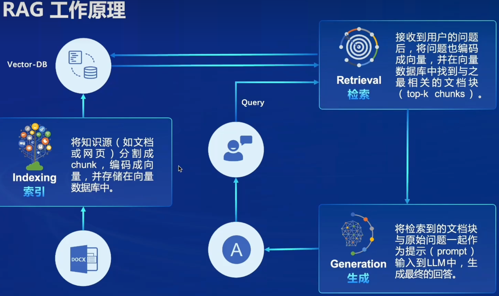

### 向量数据库(vector-DB)

**数据存储**

将文本及其他数据通过其他预训练的模型转换为固定长度的向量表示，这些向量能够捕捉文本的语义信息。

**相似性检索**

最为重要，根据用户的查询向量，使用向量数据库快速找出最相关的向量的过程。通常通过计算余弦相似度或其他相似性度量来完成。检索结果根据相似度得分进行排序最相关的文档将被用于后续的文本生成。

**向量表示的优化**

面向大规模、快速响应的需求时，需要对其优化，包括使用更高级的文本编码技术如句子嵌入或段落嵌入，以及对数据库进行优化以支持大规模向量搜索。

### 流程示例

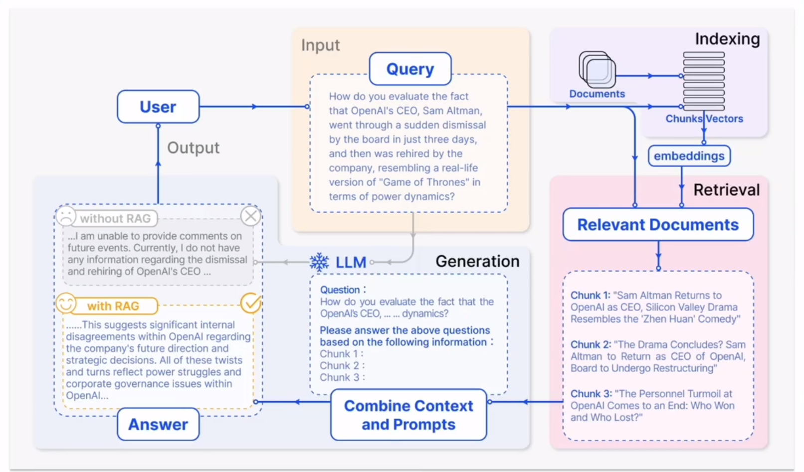

> 来源：Gao, y Xjeng, Y, Gao, x, jia, K, Pan, .,Bi, y., Dai, Y, sun,., wang, M, Wang, H, 2024. Retrieval-Augmented Generaion for Large Language Model: A survey.

RAG的概念最早是由Meta(Facebook)的Lewis等人在2020《Retrieval-Augmented Generation for Knowledge-Intensive NLp Tasks》中提出的。

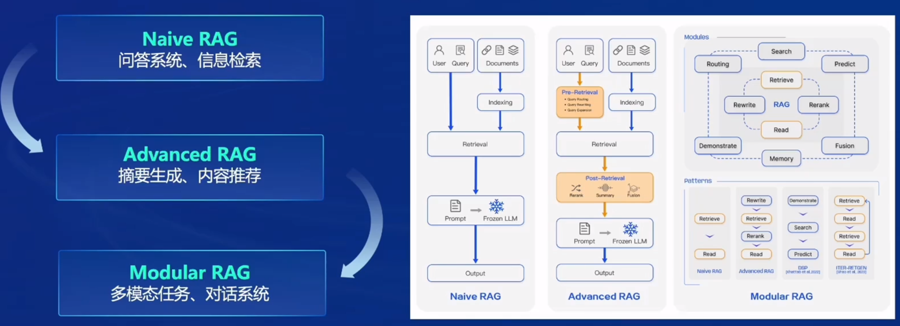

- Naive RAG：直接过程

- Advanced RAG：对用户内容进行路由、重写、扩展等预处理后再进行检索，对检索到的信息进行重排序、总结、融合等后处理。
- Modular RAG：将RAG基础后后续优化部分模块化

### RAG常见优化方法

- 嵌入优化 Embedding Optimization
  - 结合稀疏和密集检索
  - 多任务
- 索引优化 Indexing Optimization
  - 细粒度分割( Chunk )
  - 元数据

> 上述都是提升向量数据库的质量

- 查询优化 Query Optimization
  - 查询扩展、转换（如多查询方法，用LLM生成的提示工程）
  - 多查询
- 上下文管理Context Curation
  - 重排(rerank)
  - 上下文选择/压缩（如训练小NLP模型检测标记、训练信息检测器、信息压缩器）
- 迭代检索 Iterative Retrieval
  - 根据初始查询和迄今为止生成的文本进行重复搜索
- 递归检索 Recursive Retrieval
  - 迭代细化搜索查询
  - 链式推理(Chain-of-Thought)指导检索过程
- 自适应检索 Adaptive Retrieval
  - Flare ,Self-RAG
  - 使用LLMs主动决定检索的最佳时机和内容
- LLM微调 LLM Fine-tuning
  - 检索微调
  - 生成微调
  - 双重微调

### RAG vs. 微调

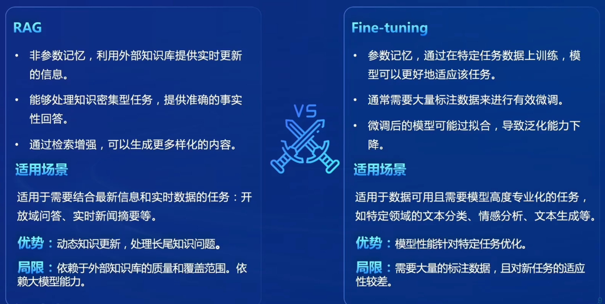

### LLM模型优化方法比较

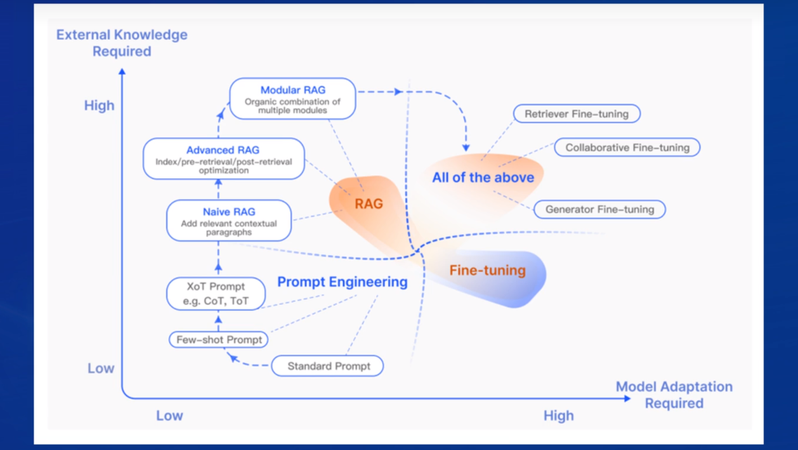

提示工程：在外部知识需求、模型适配需求上的表现较差，不能适配新的知识，并对特定任务难有优秀表现。

微调：在外部知识需求不高、模型适配需求较高

RAG：在外部知识需求较高、模型适配需求不高

三种结合：All in

### 评价方法

检索阶段和生成阶段分别评价。

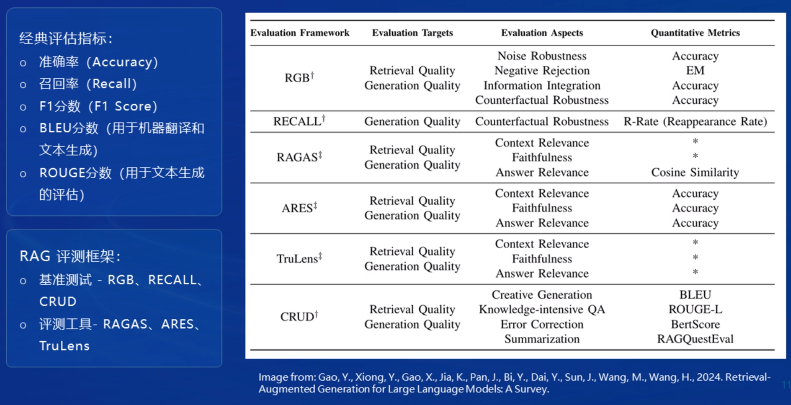

> Image from: Gao, Y., Xiong, .., Gao, x., jia, K, Pan, ., Bi, Y., Dai, Y., Sun, .., Wang, M., Wang, H. 2024. Retrieval-Augmented Generation for Large Language Models: A Survey.

## 茴香豆

茴香豆是一个基于LMs的领域知识助手,由书生浦语团队开发的开源大模型应用。

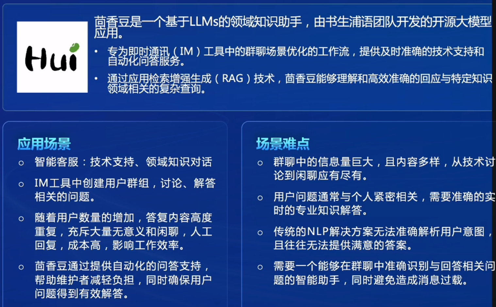

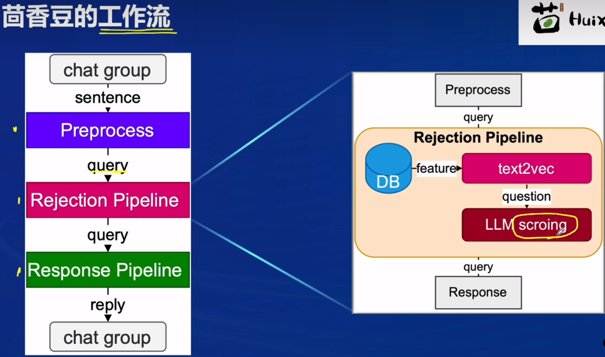

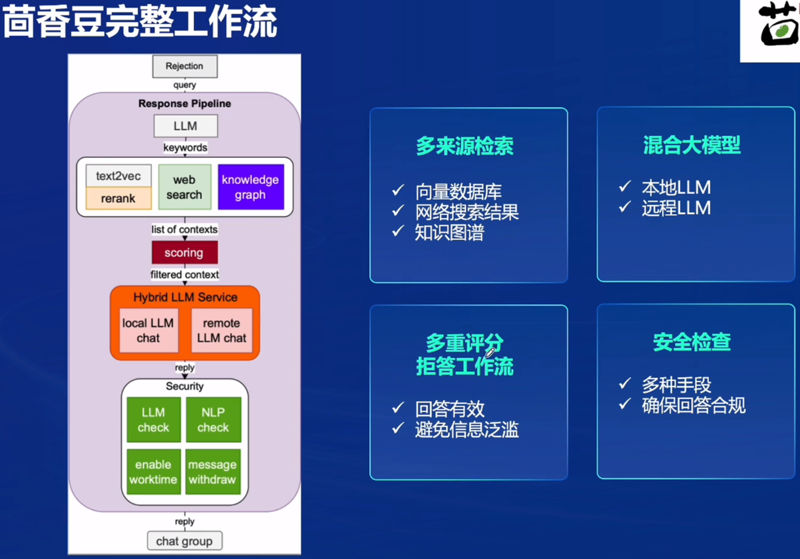

应答模块：多来源检索、混合模型、安全评估来提升模型性能。

## 作业

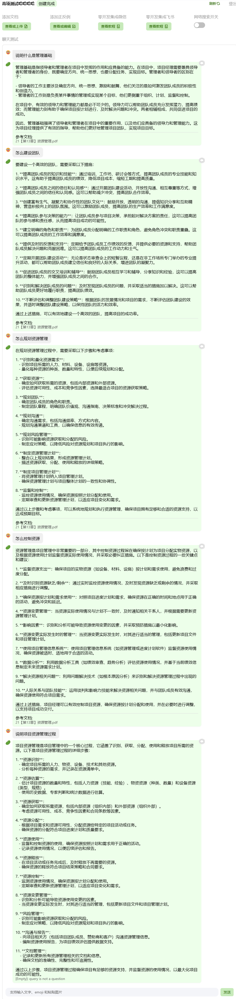

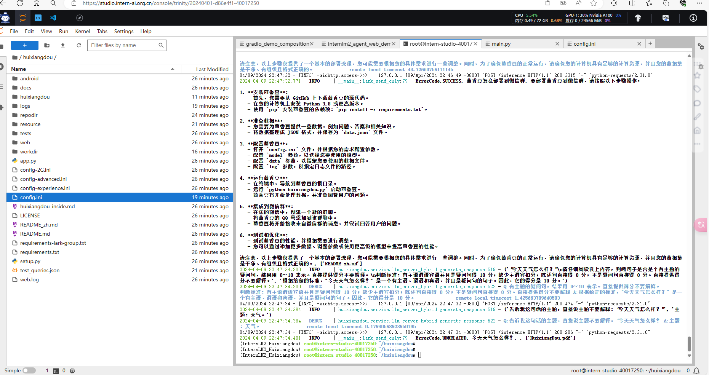

进阶：云端部署个人RAG，选择高项知识pdf文档

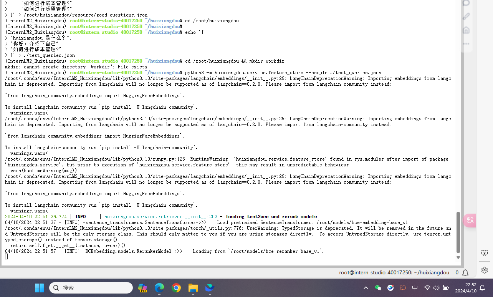

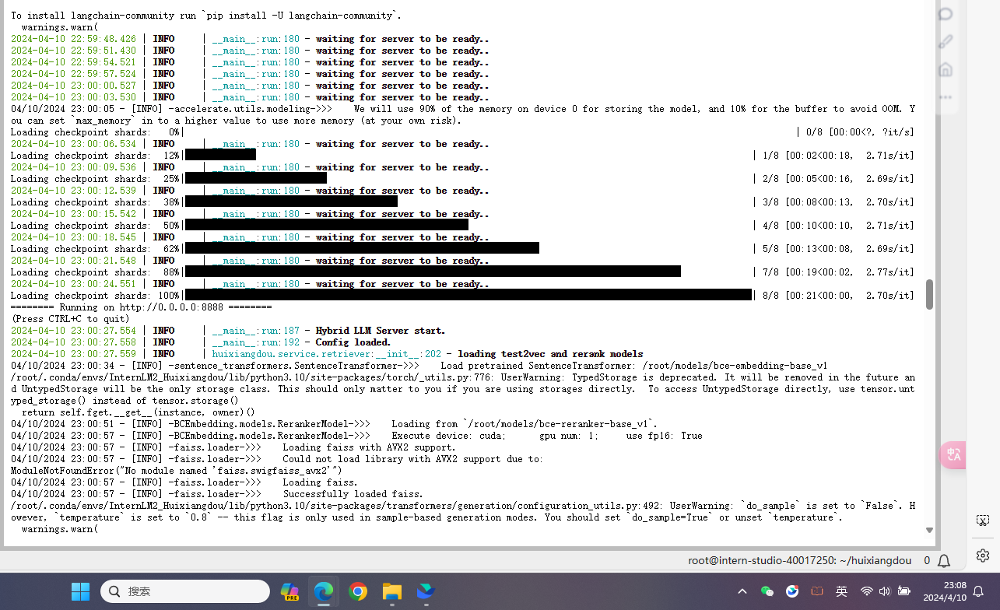

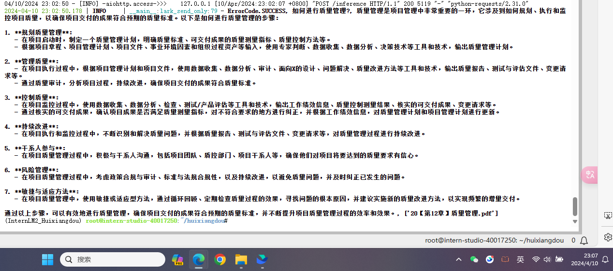