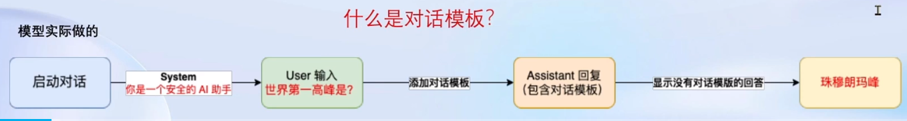
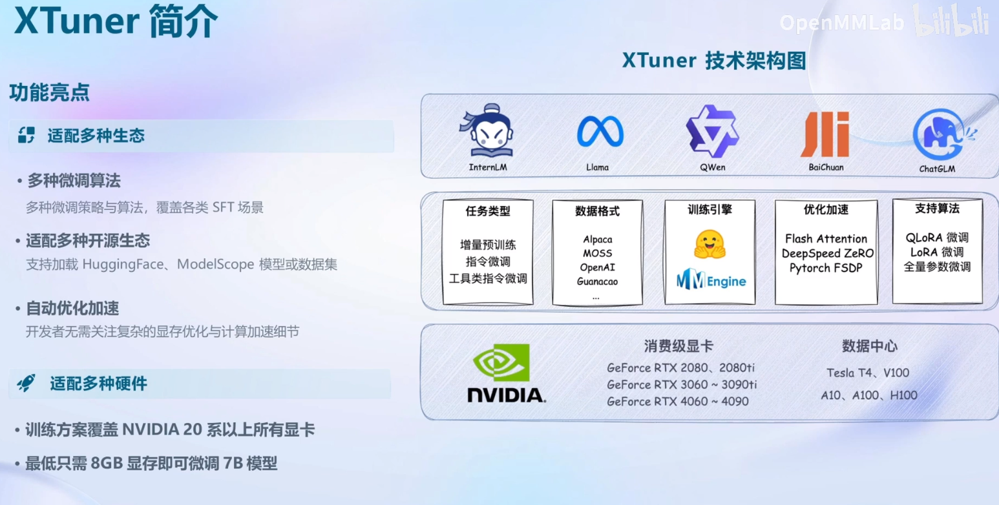

# 书生·浦语大模型实战营第二期培训总结

## 第四课-概览

- Finetune简介
- Xtune介绍
- 8GB显存实战LLM
- 实战

## Finetune简介

LLM 的下游应用中，**增量预训练**和**指令跟随**是经常会用到两种的微调模式。
**增量预训练微调**
使用场景:让基座模型学习到一些新知识，如某个垂类领域的常识训练数据:文章、书籍、代码等。
**指令跟随微调**
使用场景:让模型学会对话模板，根据人类指令进行对话训练数据:高质量的对话、问答数据。


### 指令跟随微调

指令跟随微调是为了得到能够实际对话的 LLM介绍指令跟随微调前，需要先了解如何使用LLM进行对话
在实际对话时，通常会有三种角色：

- System： 给定一些上下文信息，比如“你是一个安全的 A1 助手”
- User： 实际用户，会提出一些问题，比如“世界第一高峰是?”
- Assistant：根据 的输入，结合 System 的上下文信息，做出回答，比如“珠穆朗玛峰”

在使用对话模型时，通常是不会感知到这三种角色的



**对话模板**
对话模板是为了能够让 LLM 区分出，System、User 和 Assistant不同的模型会有不同的模板。

不同平台和模型使用的对话模板不同，用不同的符号如`<<SYS>>`（LlaMa2） 或 `<|System|>` （InternLM）指代System上下文开始。


在推理阶段，用户不需要进行角色分配，System是由模板自动添加，用户输入自动放入Usr。

将问答输入构建成模板形式输入模型，并进行损失计算。只有回答部分是希望模型进行优化的。


### 增量预训练微调

不需要构建问答对，只是事实陈述句。训练时，将`system` 和 `input` 模板清空即可


 


## XTuner简介



将复杂的数据处理步骤在XTuner中进行了集成，可以支持多种平台的模型以及大部分开源数据集格式

**Flash Attention**
Flash Attention 将 Attention 计算并行化避免了计算过程中 Attention Score NxN的显存占用(训练过程中的 N 都比较大)

**DeepSpeed ZeRO**
ZeRO 优化，通过将训练过程中的参数、梯度和优化器状态切片保存，能够在多 GPU训练时显著节省显存
除了将训练中间状态切片外，DeepSpeed 训练时使用 FP16 的权重，相较于 Pytorch 的 AMP 训练在单 GPU 上也能大幅节省显存


## InternLM2 1.8B模型

提供3个版本的开源模型

- InternLM2-1.8B: 具有高质量和高适应灵活性的基础模型，为下游深度适应提供了良好的起点。
- InternLM2-Chat-1.8B-SFT: 在 InternLM2-1.8B 上进行监督微调(SFT)后得到的对话模型。
- InternLM2-Chat-1.8B: 通过在线 RLHF 在 InternLM2-Chat-1.8B-SFT 之上进一步对齐。InternLM2-Chat-1.88 表现出更好的指令跟随、聊天体验和函数调用推荐下游应用程序使用。(模型大小仅为3.78GB)
  在 FP16 精度模式下，InternLM2-1.8B 仅需 4GB 显存的笔记本显卡即可顺畅运行。拥有 8GB 显存的消费级显卡，即可轻松进行 1.8B 模型的微调工作。如此低的硬件门槛非常适合初学者使用，以深入了解和掌握大模型的全链路。

## 多模态大模型

文本+图像多模态就是在图像上加入了Image Projector 使图像向量化。

LLaVA方案：使用GPT-4V对图像数据生成描述，构建大量数据对，格式为：`<question text><image> --  <answer text>`

训练过程：预训练+微调

- 预训练：利用上述数据对训练Image Projector的过程，数据为图像+标题(短文本)
- 微调：利用图像+复杂对话文本进行微调，相当于指令微调的增量训练


## XTuner实践

### 环境准备

```bash
conda create --name xtuner0.1.17 python=3.10 -y

# 激活环境
conda activate xtuner0.1.17
# 进入家目录 （~的意思是 “当前用户的home路径”）
cd ~
# 创建版本文件夹并进入，以跟随本教程
mkdir -p /root/xtuner0117 && cd /root/xtuner0117

# 拉取 0.1.17 的版本源码
git clone -b v0.1.17  https://github.com/InternLM/xtuner
# 无法访问github的用户请从 gitee 拉取:
# git clone -b v0.1.15 https://gitee.com/Internlm/xtuner

# 进入源码目录
cd /root/xtuner0117/xtuner

# 从源码安装 XTuner
pip install -e '.[all]'
```

> 假如速度太慢可以 `Ctrl + C` 退出后换成 `pip install -e '.[all]' -i https://mirrors.aliyun.com/pypi/simple/`

### 数据准备

初始化openai数据格式的数据

```python
import json

# 设置用户的名字
name = '不要姜葱蒜大佬'
# 设置需要重复添加的数据次数
n =  10000

# 初始化OpenAI格式的数据结构
data = [
    {
        "messages": [
            {
                "role": "user",
                "content": "请做一下自我介绍"
            },
            {
                "role": "assistant",
                "content": "我是{}的小助手，内在是上海AI实验室书生·浦语的1.8B大模型哦".format(name)
            }
        ]
    }
]

# 通过循环，将初始化的对话数据重复添加到data列表中
for i in range(n):
    data.append(data[0])

# 将data列表中的数据写入到一个名为'personal_assistant.json'的文件中
with open('personal_assistant.json', 'w', encoding='utf-8') as f:
    # 使用json.dump方法将数据以JSON格式写入文件
    # ensure_ascii=False 确保中文字符正常显示
    # indent=4 使得文件内容格式化，便于阅读
    json.dump(data, f, ensure_ascii=False, indent=4)
```

### 模型准备

准备`internlm2-chat-1_8b` 模型

```text
|-- model/
    |-- tokenizer.model
    |-- config.json
    |-- .mdl
    |-- tokenization_internlm2.py
    |-- model-00002-of-00002.safetensors
    |-- tokenizer_config.json
    |-- model-00001-of-00002.safetensors
    |-- model.safetensors.index.json
    |-- configuration.json
    |-- .msc
    |-- special_tokens_map.json
    |-- .mv
    |-- modeling_internlm2.py
    |-- README.md
    |-- configuration_internlm2.py
    |-- generation_config.json
    |-- tokenization_internlm2_fast.py
```

准备模型配置文件

```bash
# 创建一个存放 config 文件的文件夹
mkdir -p /root/ft/config

# 使用 XTuner 中的 copy-cfg 功能将 config 文件复制到指定的位置
xtuner copy-cfg internlm2_1_8b_qlora_alpaca_e3 /root/ft/config
```


#### 步骤小结

1. 首先在 GitHub 上克隆了 XTuner 的源码，并把相关的配套库也通过 pip 的方式进行了安装。

2. 然后根据自己想要做的事情，利用脚本准备好了一份关于调教模型认识自己身份弟位的数据集。

3. 再然后根据自己的显存及任务情况确定了使用 InternLM2-chat-1.8B 这个模型，并且将其复制到的文件夹里。

4. 最后在 XTuner 已有的配置文件中，根据微调方法、数据集和模型挑选出最合适的配置文件并复制到我们新建的文件夹中。

   配置文件主要分为5个部分

   >1. **PART 1 Settings**：涵盖了模型基本设置，如预训练模型的选择、数据集信息和训练过程中的一些基本参数（如批大小、学习率等）。
   >2. **PART 2 Model & Tokenizer**：指定了用于训练的模型和分词器的具体类型及其配置，包括预训练模型的路径和是否启用特定功能（如可变长度注意力），这是模型训练的核心组成部分。
   >3. **PART 3 Dataset & Dataloader**：描述了数据处理的细节，包括如何加载数据集、预处理步骤、批处理大小等，确保了模型能够接收到正确格式和质量的数据。
   >4. **PART 4 Scheduler & Optimizer**：配置了优化过程中的关键参数，如学习率调度策略和优化器的选择，这些是影响模型训练效果和速度的重要因素。
   >5. **PART 5 Runtime**：定义了训练过程中的额外设置，如日志记录、模型保存策略和自定义钩子等，以支持训练流程的监控、调试和结果的保存。

经过了以上的步骤后， `ft` 文件夹里应该是这样的：

```text
|-- ft/
    |-- config/
        |-- internlm2_1_8b_qlora_alpaca_e3_copy.py
    |-- model/
        |-- tokenizer.model
        |-- config.json
        |-- tokenization_internlm2.py
        |-- model-00002-of-00002.safetensors
        |-- tokenizer_config.json
        |-- model-00001-of-00002.safetensors
        |-- model.safetensors.index.json
        |-- configuration.json
        |-- special_tokens_map.json
        |-- modeling_internlm2.py
        |-- README.md
        |-- configuration_internlm2.py
        |-- generation_config.json
        |-- tokenization_internlm2_fast.py
    |-- data/
        |-- personal_assistant.json
        |-- generate_data.py
```

### 开始训练

准备好配置文件，使用`xtuner train` 开始训练

 `--work-dir` 指定特定的文件保存位置

可以结合 XTuner 内置的 `deepspeed` 来加速整体的训练过程，共有三种不同的 `deepspeed` 类型可进行选择，分别是 `deepspeed_zero1`, `deepspeed_zero2` 和 `deepspeed_zero3`

```bash
# 使用 deepspeed 来加速训练
xtuner train /root/ft/config/internlm2_1_8b_qlora_alpaca_e3_copy.py --work-dir /root/ft/train_deepspeed --deepspeed deepspeed_zero2
```


#### DeepSpeed优化器及其选择方法

DeepSpeed是一个深度学习优化库，由微软开发，旨在提高大规模模型训练的效率和速度。它通过几种关键技术来优化训练过程，包括模型分割、梯度累积、以及内存和带宽优化等。DeepSpeed特别适用于需要巨大计算资源的大型模型和数据集。

在DeepSpeed中，`zero` 代表“ZeRO”（Zero Redundancy Optimizer），是一种旨在降低训练大型模型所需内存占用的优化器。ZeRO 通过优化数据并行训练过程中的内存使用，允许更大的模型和更快的训练速度。ZeRO 分为几个不同的级别，主要包括：

- **deepspeed_zero1**：这是ZeRO的基本版本，它优化了模型参数的存储，使得每个GPU只存储一部分参数，从而减少内存的使用。
- **deepspeed_zero2**：在deepspeed_zero1的基础上，deepspeed_zero2进一步优化了梯度和优化器状态的存储。它将这些信息也分散到不同的GPU上，进一步降低了单个GPU的内存需求。
- **deepspeed_zero3**：这是目前最高级的优化等级，它不仅包括了deepspeed_zero1和deepspeed_zero2的优化，还进一步减少了激活函数的内存占用。这通过在需要时重新计算激活（而不是存储它们）来实现，从而实现了对大型模型极其内存效率的训练。

选择哪种deepspeed类型主要取决于你的具体需求，包括模型的大小、可用的硬件资源（特别是GPU内存）以及训练的效率需求。一般来说：

- 如果你的模型较小，或者内存资源充足，可能不需要使用最高级别的优化。
- 如果你正在尝试训练非常大的模型，或者你的硬件资源有限，使用deepspeed_zero2或deepspeed_zero3可能更合适，因为它们可以显著降低内存占用，允许更大模型的训练。
- 选择时也要考虑到实现的复杂性和运行时的开销，更高级的优化可能需要更复杂的设置，并可能增加一些计算开销。

#### 模型续训

`--resume {checkpoint_path}` 来实现模型的继续训练

```bash
# 模型续训
xtuner train /root/ft/config/internlm2_1_8b_qlora_alpaca_e3_copy.py --work-dir /root/ft/train --resume /root/ft/train/iter_600.pth
```

### 模型转换、整合、测试及部署

#### 转换

本质即将pytorch训练出的模型转为目前通用的HuggingFace格式文件

```bash
# 创建一个保存转换后 Huggingface 格式的文件夹
mkdir -p /root/ft/huggingface

# 模型转换
# xtuner convert pth_to_hf ${配置文件地址} ${权重文件地址} ${转换后模型保存地址}
xtuner convert pth_to_hf /root/ft/train/internlm2_1_8b_qlora_alpaca_e3_copy.py /root/ft/train/iter_768.pth /root/ft/huggingface
```

转换完成后，可以看到模型被转换为 Huggingface 中常用的 .bin 格式文件，这就代表着文件成功被转化为 Huggingface 格式了。

```
|-- huggingface/
    |-- adapter_config.json
    |-- xtuner_config.py
    |-- adapter_model.bin
    |-- README.md
```

**此时，huggingface 文件夹即为平时所理解的所谓 “LoRA 模型文件”**

> 可以简单理解：LoRA 模型文件 = Adapter

除此之外，还可以在转换的指令中添加几个额外的参数，包括以下两个：

| 参数名                | 解释                                         |
| --------------------- | -------------------------------------------- |
| --fp32                | 代表以fp32的精度开启，假如不输入则默认为fp16 |
| --max-shard-size {GB} | 代表每个权重文件最大的大小（默认为2GB）      |

假如有特定的需要，可以在上面的转换指令后进行添加。由于本次测试的模型文件较小，并且已经验证过拟合，故没有添加。假如加上的话应该是这样的：

```
xtuner convert pth_to_hf /root/ft/train/internlm2_1_8b_qlora_alpaca_e3_copy.py /root/ft/train/iter_768.pth /root/ft/huggingface --fp32 --max-shard-size 2GB
```

#### 整合

LoRA 或者 QLoRA 微调出来的模型其实并不是一个完整的模型，而是一个额外的层（adapter）。这个层最终还是要与原模型进行组合才能被正常使用。

```bash
# 创建一个名为 final_model 的文件夹存储整合后的模型文件
mkdir -p /root/ft/final_model

# 解决一下线程冲突的 Bug 
export MKL_SERVICE_FORCE_INTEL=1

# 进行模型整合
# xtuner convert merge  ${NAME_OR_PATH_TO_LLM} ${NAME_OR_PATH_TO_ADAPTER} ${SAVE_PATH} 
xtuner convert merge /root/ft/model /root/ft/huggingface /root/ft/final_model
```

可选参数，包括：

| 参数名                 | 解释                                                         |
| ---------------------- | ------------------------------------------------------------ |
| --max-shard-size {GB}  | 代表每个权重文件最大的大小（默认为2GB）                      |
| --device {device_name} | 这里指的就是device的名称，可选择的有cuda、cpu和auto，默认为cuda即使用gpu进行运算 |
| --is-clip              | 这个参数主要用于确定模型是不是CLIP模型，假如是的话就要加上，不是就不需要添加 |

整合完成后可以查看在 final_model 文件夹下的内容。

```text
|-- final_model/
    |-- tokenizer.model
    |-- config.json
    |-- pytorch_model.bin.index.json
    |-- pytorch_model-00001-of-00002.bin
    |-- tokenization_internlm2.py
    |-- tokenizer_config.json
    |-- special_tokens_map.json
    |-- pytorch_model-00002-of-00002.bin
    |-- modeling_internlm2.py
    |-- configuration_internlm2.py
    |-- tokenizer.json
    |-- generation_config.json
    |-- tokenization_internlm2_fast.py
```

#### 对话测试

XTuner提供了一套基于Transformers的对话代码，可在终端直接与HuggingFace格式的模型进行对话。需要选择模型路径、对应的提示词模板（prompt-template）

> 了解具体模型的 prompt-template 或者 XTuner 里支持的 prompt-tempolate，可以到 XTuner 源码中的 `xtuner/utils/templates.py`

```bash
# 与模型进行对话
xtuner chat /root/ft/final_model --prompt-template internlm2_chat
```

对于 `xtuner chat` 这个指令而言，还有很多其他的参数可以进行设置的，包括：

| 启动参数            | 解释                                                         |
| ------------------- | ------------------------------------------------------------ |
| --system            | 指定SYSTEM文本，用于在对话中插入特定的系统级信息             |
| --system-template   | 指定SYSTEM模板，用于自定义系统信息的模板                     |
| **--bits**          | 指定LLM运行时使用的位数，决定了处理数据时的精度              |
| --bot-name          | 设置bot的名称，用于在对话或其他交互中识别bot                 |
| --with-plugins      | 指定在运行时要使用的插件列表，用于扩展或增强功能             |
| **--no-streamer**   | 关闭流式传输模式，对于需要一次性处理全部数据的场景           |
| **--lagent**        | 启用lagent，用于特定的运行时环境或优化                       |
| --command-stop-word | 设置命令的停止词，当遇到这些词时停止解析命令                 |
| --answer-stop-word  | 设置回答的停止词，当生成回答时遇到这些词则停止               |
| --offload-folder    | 指定存放模型权重的文件夹，用于加载或卸载模型权重             |
| --max-new-tokens    | 设置生成文本时允许的最大token数量，控制输出长度              |
| **--temperature**   | 设置生成文本的温度值，较高的值会使生成的文本更多样，较低的值会使文本更确定 |
| --top-k             | 设置保留用于顶k筛选的最高概率词汇标记数，影响生成文本的多样性 |
| --top-p             | 设置累计概率阈值，仅保留概率累加高于top-p的最小标记集，影响生成文本的连贯性 |
| --seed              | 设置随机种子，用于生成可重现的文本内容                       |

 `--adapter` ，这个参数主要的作用就是可以在转化后的 adapter 层与原模型整合之前来对该层进行测试。

```
# 使用 --adapter 参数与完整的模型进行对话
xtuner chat /root/ft/model --adapter /root/ft/huggingface --prompt-template internlm2_chat
```

#### Web 部署

下载网页端 web demo 所需要的依赖。

```
pip install streamlit==1.24.0
```

下载 [InternLM](https://github.com/InternLM/InternLM) 项目代码（欢迎Star）！

```bash
# 创建存放 InternLM 文件的代码
mkdir -p /root/ft/web_demo && cd /root/ft/web_demo

# 拉取 InternLM 源文件
git clone https://github.com/InternLM/InternLM.git

# 进入该库中
cd /root/ft/web_demo/InternLM
```

修改 `/root/ft/web_demo/InternLM/chat/web_demo.py`  模型路径和分词器路径，删除了 avatar 及 system_prompt 部分的内容，与 cli 中的超参数进行对齐

将云训练平台的端口映射到本地，PowerShell 中输入。

```bash
# 从本地使用 ssh 连接 studio 端口
# 将下方端口号 38374 替换成自己的端口号
ssh -CNg -L 6006:127.0.0.1:6006 root@ssh.intern-ai.org.cn -p 38374
```

运行 `/root/personal_assistant/code/InternLM` 目录下的 `web_demo.py` 文件

```
streamlit run /root/ft/web_demo/InternLM/chat/web_demo.py --server.address 127.0.0.1 --server.port 6006
```

> 注意：要在浏览器打开 `http://127.0.0.1:6006` 页面后，模型才会加载。

## 作业

### 复现过程

开始炼丹


模型加载


训练过程


中途测试


过拟合了

