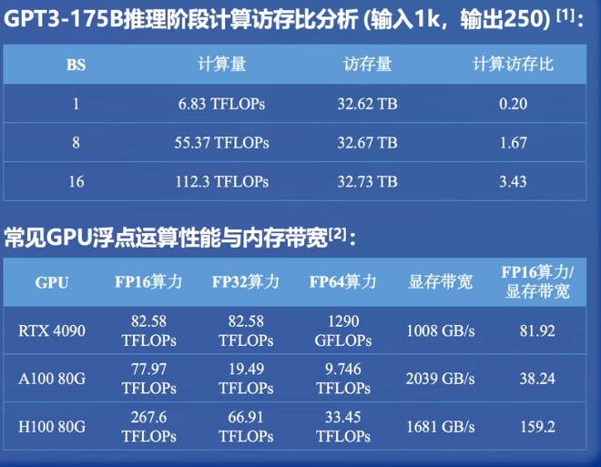
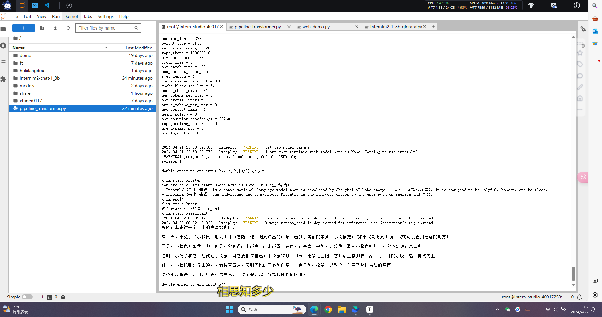
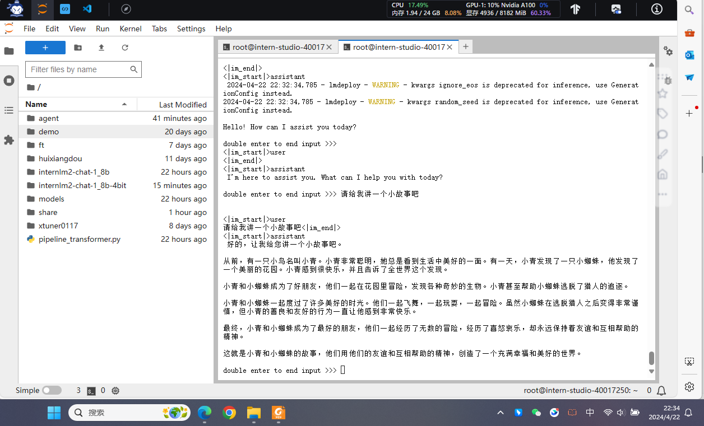
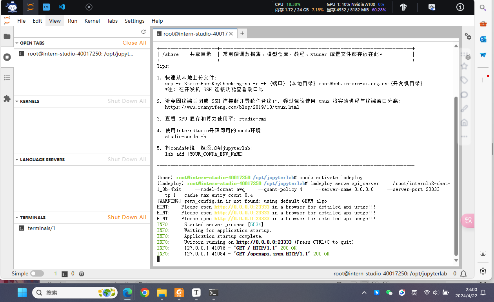
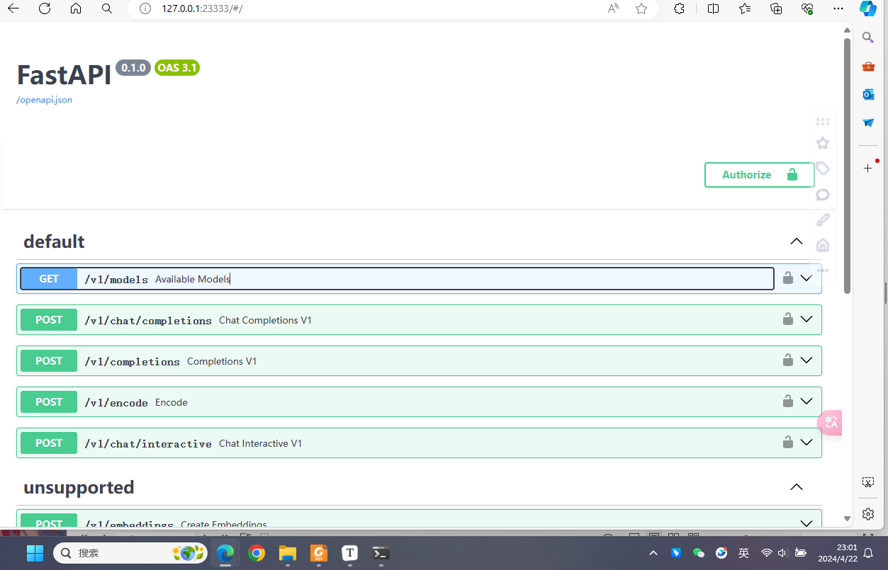
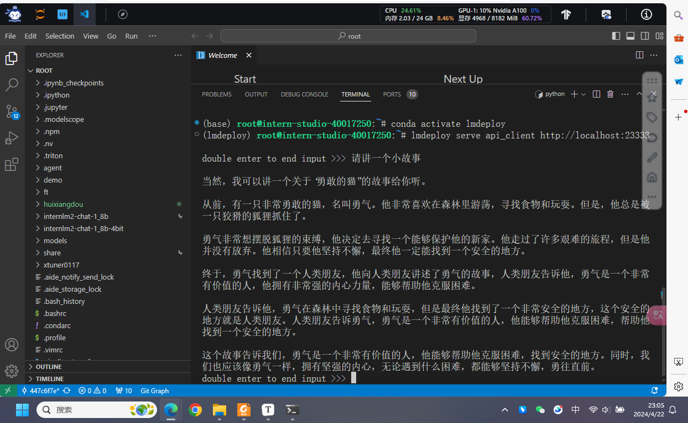
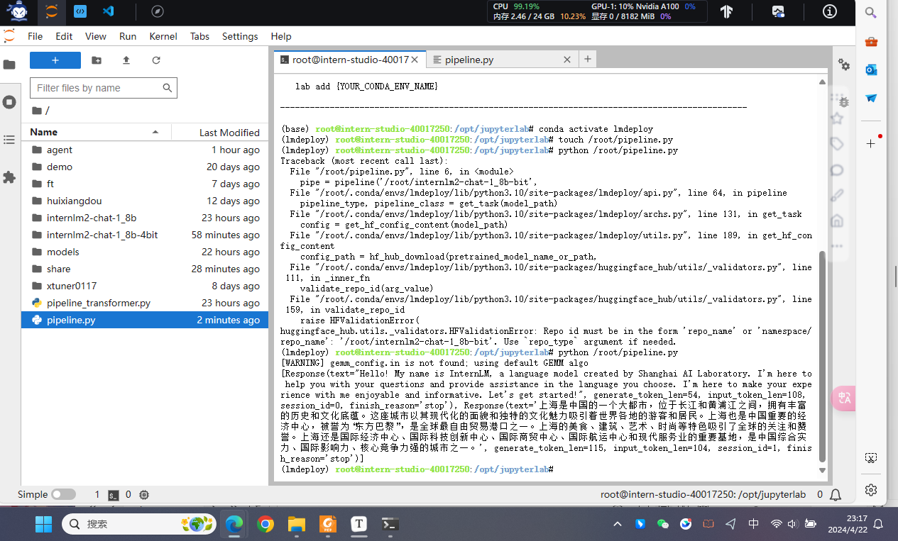
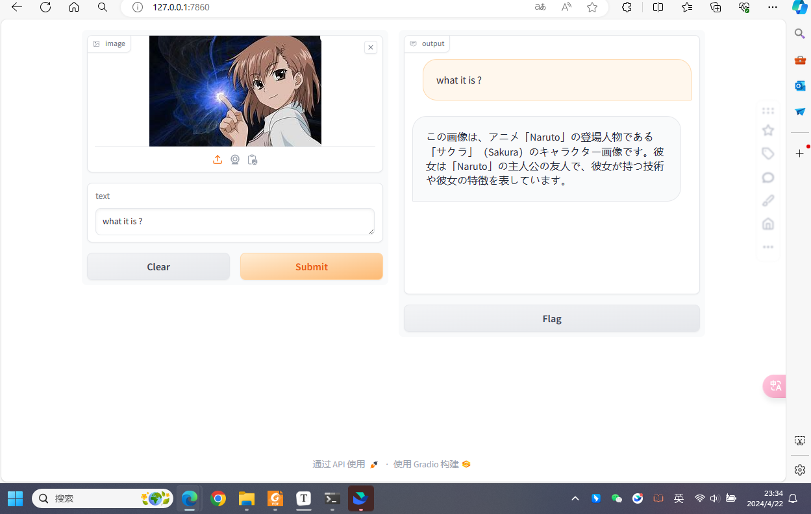

# 书生·浦语大模型实战营第二期培训总结

## 第五课-概览

- 大模型部署背景
- 大模型部署方法
- LMDeploy简介
- 动手实践

## 大模型部署背景

**定义**

- 在软件工程中，:部署通常指的是将开发完毕的软件投入使用的过程。

- 在人工智能领域，模型部署是实现深度学习算法落地应用的关键步骤。简单来说，模型部署就是将训练好的深度学习模型在特定环境中运行的过程。

**场景**

- 服务器端:CPU部署，单GPU/TPU/NPU部署，多卡/集群部署…
- 移动端/边缘端:移动机器人，手机.…

**挑战**

- 计算密集（compute-bound）: 指推理过程中，绝大部分时间消耗在数值计算上；针对计算密集型场景，可以通过使用更快的硬件计算单元来提升计算速度。
- 访存密集（memory-bound）: 指推理过程中，绝大部分时间消耗在数据读取上；针对访存密集型场景，一般通过减少访存次数、提高计算访存比或降低访存量来优化。

计算量大，20B模型每生成1个token，就要进行约406亿次浮点运算；以此计算，生成128个token需5.2万亿次运算。[1,2]

NVIDIA A100的FP16理论运算性能为每秒77.97 TFLOPs(77万亿)。[[3]](https://www.topcpu.net/)

> [1] Cai Z, Cao M, Chen H, et al. InternLM2 Technical Report[J]. arXiv preprint arXiv:2403.17297, 2024
> [2] Kaplan J, McCandlish S, Henighan 'T, et al. Scaling laws for neural language models1. arXiv preprint arXiv:2001.08361, 2020

**大模型前向推理所需计算量计算公式**
$$
C_{forward}=2N+2n_{layer}n_{ctx}d_{attn}
$$
其中，N为模型参数量，$n_{layer}$ 为模型层数，$n_{ctx}$ 为上下文长度(默认1024)，$d_{attn}$ 为注意力输出维度。单位：FLOPs per Token

**访问瓶颈**

大模型推理是“访存密集”型任务，硬件计算速度远快于显存带宽，存在访存性能瓶颈。即GPU大部分时间在摸鱼……



> [[1]](https://cloud.baidu.com/article/919629) [[2]](https://www.topcpu.net/)

**动态请求**

- 请求量不确定
- 请求时间不确定
- Token逐个生成，生成数量不确定

## 部署方法

### 模型剪枝

剪枝指移除模型中不必要或多余的组件，比如参数，以使模型更加高效。通过对模型中贡献有限的兄余参数进行枝，在保证性能最低下降的同时，可以减小存储需求、提高计算效率。

**非结构化剪枝**（SparseGPT，LoRAPruner，Wanda）
指移除个别参数，而不考虑整体网络结构。这种方法通过将低于阈值的参数置零的方式对个别权重或神经元进行处理。
**结构化剪枝**（LLM-Pruner）
根据预定义规则移除连接或分层结构，同时保持整体网络结构。这种方法一次性地针对整组权重，优势在于降低模型复杂性和内存使用，同时保持整体的LLM结构完整.

### 知识蒸馏

经典的模型压缩方法，核心思想是通过引导轻量化的学生模型“模仿”性能更好、结构更复杂的教师模型，在不改变学生模型结构的情况下提高其性能。

- 上下文学习（ICL）：lCL distillation
- 思维链（CoT）：MT-COT、Fine-tune-CoT
- 指令跟随（IF）：LaMini-LM

### 量化

量化技术将传统的表示方法中的浮点数转换为整数或其他离散形式，以减轻深度学习模型的存储和计算负担。

注意，量化是用定点数进行模型存储，计算时将模型反量化为浮点数计算，将计算结果以定点数进行存储。量化后进行存储可以提升访存的性能，提升数据传输效率，从而提升计算效率。

**量化感知训练**(QAT)：LLM-QAT
量化目标无缝地集成到模型的训练过程中。这种方法使LLM在训练过程中适应低精度表示
**量化感知微调**(QAF)：PEQA，QLORA
QAF涉及在微调过程中对LLM进行量化。主要目标是确保经过微调的LLM在量化为较低位宽后仍保持性能。
**训练后量化**(PTQ)：LLM.int8，AWQ
在LLM的训练阶段完成后对其参数进行量化。PTQ的主要目标是减少LLM的存储和计算复杂性，而无需对LLM架构进行修改或进行重新训练。

## LMDeploy

LMDeploy 由 MMDeploy 和 MMRazor 团队联合开发是涵盖了 LLM 任务的全套轻量化、部署和服务解决方案。

### 模型高效推理

`lmdeploy chat -h`

TurboMind是LMDeploy团队开发的一款关于 LLM 推理的高效推理引擎。它的主要功能包括:LLaMa 结构模型的支持(cuda实现), continuous batch推理模式和可扩展的 KV 缓存管理器(解决动态请求)。

### 模型量化压缩

`lmdeploy lite -h`

### 服务化部署

`lmdeploy serve -h`

将LLM封装为HTTP API服务，支持Triton扩展。

## 动手实践

### 前置知识

#### HuggingFace

托管在HuggingFace社区的模型通常采用HuggingFace格式存储，简写为**HF格式**。

国内可以使用阿里巴巴的[MindScope](https://www.modelscope.cn/home)社区，或者上海AI Lab搭建的[OpenXLab](https://openxlab.org.cn/home)社区，上面托管的模型也通常采用**HF格式**。

#### TurboMind

TurboMind是LMDeploy团队开发的一款关于**LLM推理的高效推理引擎**，它的主要功能包括：LLaMa 结构模型的支持，continuous batch 推理模式和可扩展的 KV 缓存管理器。

仅支持推理TurboMind格式的模型，会**自动**将HF格式模型转换为TurboMind格式的模型。

- LMDeploy也可以使用pytorch作为推理引擎。
- TurboMind是LMDeploy的一个推理引擎，是一个子模块。
- TurboMind是推理引擎的名字，TurboMind模型是一种模型存储格式，TurboMind引擎只能推理TurboMind格式的模型。

### 作业过程

#### 聊天尝试

使用LMDeploy与模型进行对话的通用命令格式为：

```bash
lmdeploy chat [HF格式模型路径/TurboMind格式模型路径]
```

有关LMDeploy的chat功能的更多参数可通过-h命令查看。

```bash
lmdeploy chat -h
```



#### 量化尝试

使用**KV8量化**和**W4A16**量化。

> - KV8量化是指将逐 Token（Decoding）生成过程中的上下文 K 和 V 中间结果进行 INT8 量化（计算时再反量化），以降低生成过程中的显存占用。
> - W4A16 量化，将 FP16 的模型权重量化为 INT4，Kernel 计算时，访存量直接降为 FP16 模型的 1/4，大幅降低了访存成本。Weight Only 是指仅量化权重，数值计算依然采用 FP16（需要将 INT4 权重反量化）。

##### KV Cache

KV Cache是一种缓存技术，通过存储键值对的形式来复用计算结果，以达到提高性能和降低内存消耗的目的。在大规模训练和推理中，KV Cache可以显著减少重复计算量，从而提升模型的推理速度。

KV Cache全部存储于显存，以加快访存速度。当显存空间不足时，也可以将KV Cache放在内存，通过缓存管理器控制将当前需要使用的数据放入显存。

**模型在运行时，占用的显存可大致分为三部分**：模型参数本身占用的显存、KV Cache占用的显存，以及中间运算结果占用的显存。

LMDeploy的KV Cache管理器可以通过设置`--cache-max-entry-count`参数，控制KV缓存**占用剩余显存**的最大比例。默认的比例为0.8。

改变`--cache-max-entry-count`参数，设为0.5。

```bash
lmdeploy chat /root/internlm2-chat-1_8b --cache-max-entry-count 0.5
```

##### W4A16 量化

LMDeploy使用AWQ算法，实现模型4bit权重量化。推理引擎TurboMind提供了非常高效的4bit推理cuda kernel，性能是FP16的2.4倍以上。它支持以下NVIDIA显卡：

- 图灵架构（sm75）：20系列、T4
- 安培架构（sm80,sm86）：30系列、A10、A16、A30、A100
- Ada Lovelace架构（sm90）：40 系列

运行前，首先安装一个依赖库。

```bash
pip install einops==0.7.0
```

仅需执行一条命令，就可以完成模型量化工作。

```bash
lmdeploy lite auto_awq \
   /root/internlm2-chat-1_8b \
  --calib-dataset 'ptb' \
  --calib-samples 128 \
  --calib-seqlen 1024 \
  --w-bits 4 \
  --w-group-size 128 \
  --work-dir /root/internlm2-chat-1_8b-4bit
```

以下是W4A16的量化以KV Cache参数为0.4的对话效果：

`lmdeploy chat /root/internlm2-chat-1_8b-4bit --model-format awq --cache-max-entry-count 0.4`




#### LMDeploy服务(serve)

将大模型封装为API接口服务，供客户端访问。


- 模型推理/服务。主要提供模型本身的推理，一般来说可以和具体业务解耦，专注模型推理本身性能的优化。可以以模块、API等多种方式提供。
- API Server。中间协议层，把后端推理/服务通过HTTP，gRPC或其他形式的接口，供前端调用。
- Client。可以理解为前端，与用户交互的地方。通过通过网页端/命令行去调用API接口，获取模型推理/服务。

以下命令启动API服务器，推理`internlm2-chat-1_8b-4bit`模型：

```bash
lmdeploy serve api_server     
	/root/internlm2-chat-1_8b-4bit     
	--model-format awq     
	--quant-policy 4    
	--server-name 0.0.0.0     
	--server-port 23333     
	--tp 1 --cache-max-entry-count 0.4
```

> model-format
>
>  `qant_policy=4` 表示 kv int4 量化，`quant_policy=8` 表示 kv int8 量化
>
> server-name和server-port表示API服务器的服务IP与服务端口；tp参数表示并行数量（GPU数量）。

查看更多参数及使用方法：

```bash
lmdeploy serve api_server -h
```





构建好服务器API后，就可以用终端（作为前端）进行访问了

`lmdeploy serve api_client http://localhost:23333`



此时用的架构是这样的：


#### python代码集成

将大模型推理集成到Python代码里面。可通过创建`TurbomindEngineConfig`，向`lmdeploy`传递参数。

```python
from lmdeploy import pipeline, TurbomindEngineConfig

# 调低 k/v cache内存占比调整为总显存的 40%
backend_config = TurbomindEngineConfig(cache_max_entry_count=0.4)

pipe = pipeline('/root/internlm2-chat-1_8b-bit',
                backend_config=backend_config,
               model_format='awq')
response = pipe(['Hi, pls intro yourself', '上海是'])
print(response)
```



#### 使用LMDeploy运行视觉多模态大模型llava


