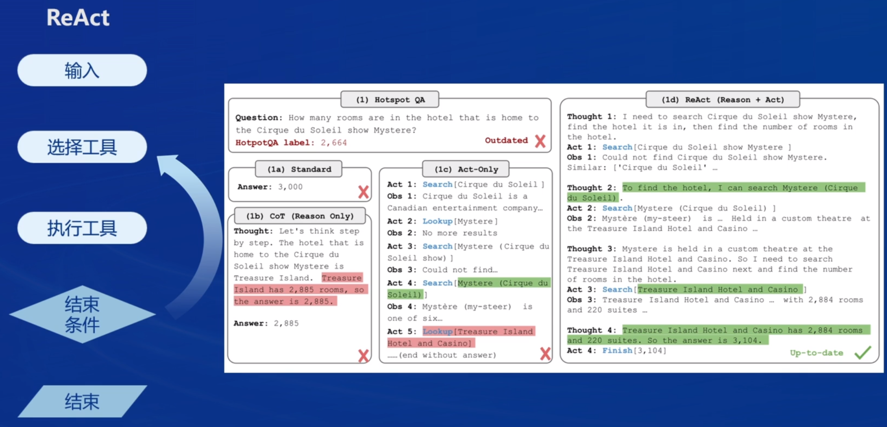

# 书生·浦语大模型实战营第二期培训总结

## 第六课-概览

Lagent&AgentLego 智能体应用搭建

**大模型局限性**

- 幻觉
- 时效性
- 可靠性

**智能体定义**

- 感知环境动态条件
- 采取动作影响环境
- 运用推理能力采取行动

**智能体组成**

- 大脑
- 感知
- 动作

**经典智能体范式**

- AutoGPT

将任务输入系统后，将任务列表发送给对应智能体，将结果存入记忆，并发送另一个智能体分配新的任务，循环直到完成任务。

- ReWoo

将输入拆分多步发送给worker执行，将2部分输出都发给solver得到结果。

- ReACT

通过选择工具进行执行，完成后由模型思考是否选用下一个工具，直到达到结束条件。

## Lagent&AgentLego

### Lagent

一个轻量级开源智能体框架，旨在让用户可以高效地构建基于大语言模型的智能体，
支持多种智能体范式。(如 AutoGPT、ReWoo、ReAct)
支持多种工具。(如谷歌搜索、Python解释器等)

### AgentLego

一个多模态工具包，旨在像乐高积木，可以快速简便地拓展自定义工具，从而组装出自己的智能体。支持多个智能体框架。(如 Lagent、LangChain、Transformers Agents)

提供大量视觉、多模态领域前沿算法

### 两者关系

## 作业

查询天气的好像网络不行。

直接使用AgentLego

AgentLegoWebUI使用

AgentLego自定义工具

