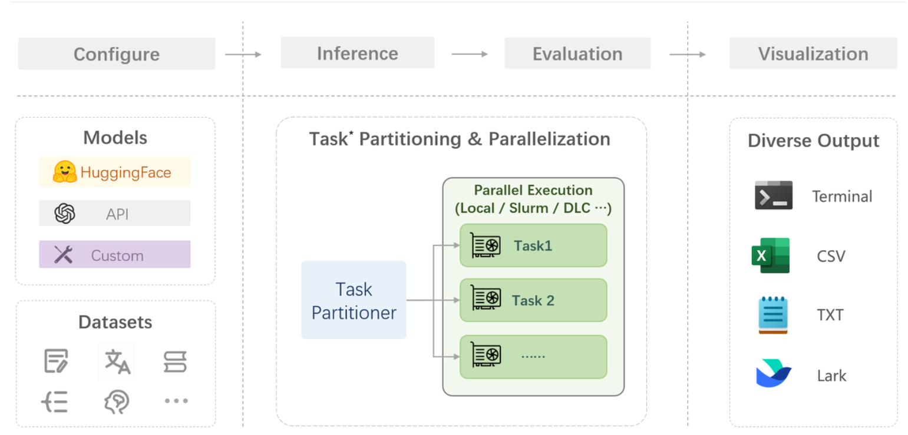
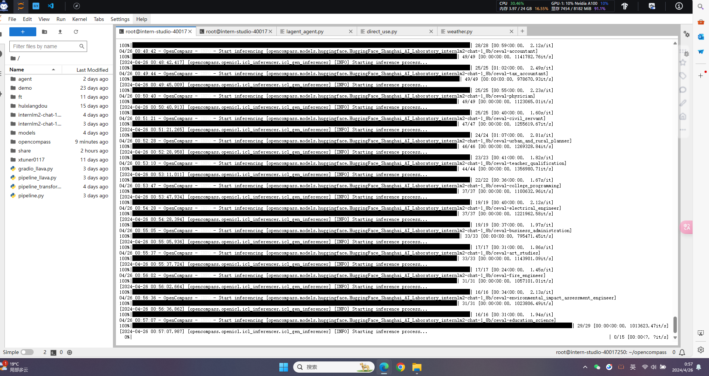

# 书生·浦语大模型实战营第二期培训总结

## 第七课

### 挑战

- 全面性
  - 大模型应用场景干变万化
  - 模型能力演进迅速
  - 如何设计和构造可扩展的能力维度体系
- 评测成本
  - 评测数十万道题需要大量算力资源
  - 基于人工打分的主观评测成本高昂
- 数据污染
  - 海量语料不可避免带来评测集污染
  - 亟需可靠的数据污染检测技术
  - 如何设计可动态更新的高质量评测基准
- 鲁棒性
  - 大模型对提示词十分敏感
  - 多次采样情况下模型性能不稳定

### 评测对象

- 基座模型
  - 海量数据无监督训练

- 对话模型
  - 指令数据有监督微调(SFT)
  - 人类偏好对齐(RLHF)

- 公开权重开源模型
  - 使用GPU/推理加速卡进行本地推理

- API模型
  - 发送网络请求获取回复

### 评测流水线

在 OpenCompass 中评估一个模型通常包括以下几个阶段：配置 -> 推理 -> 评估 -> 可视化。

- 配置：这是整个工作流的起点。您需要配置整个评估过程，选择要评估的模型和数据集。此外，还可以选择评估策略、计算后端等，并定义显示结果的方式。
- 推理与评估：在这个阶段，OpenCompass 将会开始对模型和数据集进行并行推理和评估。推理阶段主要是让模型从数据集产生输出，而评估阶段则是衡量这些输出与标准答案的匹配程度。这两个过程会被拆分为多个同时运行的“任务”以提高效率，但请注意，如果计算资源有限，这种策略可能会使评测变得更慢。如果需要了解该问题及解决方案，可以参考 FAQ: 效率。
- 可视化：评估完成后，OpenCompass 将结果整理成易读的表格，并将其保存为 CSV 和 TXT 文件。

### 作业

